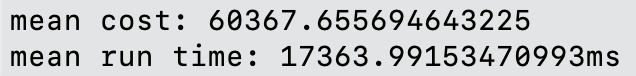

# Instructions of build and run

My coding environment is 
- numpy=1.24.2
- python=3.9

There is no special function or package used, so common environments with numpy and python should all work.

The `.py` file name is `vorto.py` and I ran it using 
```
python vorto.py path_to_txt_file
```
where `path_to_txt_file` is the path to the evaluation text file.

# Brief coding idea
I wrote a Simulated Annealing (SA) algorithm for the provided Constrained Vehicle Routing Problem (CVRP). The fundamental idea is to strategically search for the optimal solution by allowing worse solutions given temperature in a probabilistic manner. SA allows to get out of the local optimal solutions, which is suitable for problems like CVRP.

## Further works
As shown below, the algorithm is slow as my implementation of each iteration of local search requires computing the cost of a path from scratch. I tried to improve the efficiency using the commented code and `segment_penalty()`. Sadly, the improvement cannot work without violation of 12-hour constraint.

Besides, the performance of SA heavily depends on its hyperparameters like temperature and $\alpha$. I finally chose the setup that gives fairly good cost which took long time to run, but there should be a better setup.

# Results
Below is my results after running the evaluation script.



# Reference
[Blog1](https://towardsdatascience.com/optimization-techniques-simulated-annealing-d6a4785a1de7)
[Wikipedia](https://en.wikipedia.org/wiki/Simulated_annealing)